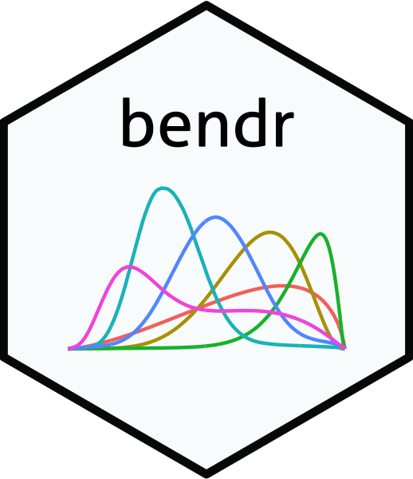

##  bendr: Built Environment Nested Dirichlet Processes in R 
<!-- badges: start -->
[](https://travis-ci.org/apeterson91/bendr)
[](https://www.gnu.org/licenses/gpl-3.0)
[](https://www.tidyverse.org/lifecycle/#maturing)
<!-- badges: end -->

## About

This is an R package that fits the Nested Dirichlet Process to grouped distance data according to 
an Inhomogenous Poisson Process model. The primary target audience is researchers interested in the effect of built environment features (BEFs) on human health, 
though other applications are possible. See the package's [website](https://apeterson91.github.io/bendr/) for an [introduction](https://apeterson91.github.io/bendr/articles/Introduction.html).
 Currently both normal and beta base measures are implemented. See the documentation for more information.


## Installation

### Development Version

 Currently this package is only available via Github. In order to install the software use the following 
 lines of R code

 ```r
 if(!require(devtools)){
	install.packages("devtools")
	library(devtools)
 }

install_github("apeterson91/bendr",dependencies = TRUE)
 ```

## Contributing

 Examples and code contributions are welcome. Feel free to start/address a feature in the issue tracker and I'll be notified shortly. 

#### Code of Conduct

Please note that `bendr` is released with a [Contributor Code of Conduct](https://www.contributor-covenant.org/). By contributing to this project, you agree to abide by its terms.


## How to cite this package

 A citation is in progress. Check back soon.

## Acknowledgments

This work was developed with support from NIH grant R01-HL131610 (PI: Sanchez).

Special thanks to Emily Hector and Andrew Whiteman for help with the package name.

