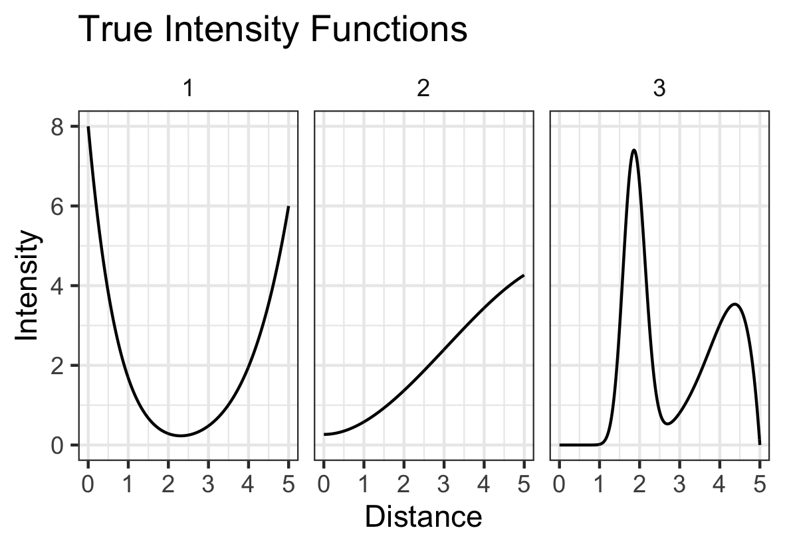
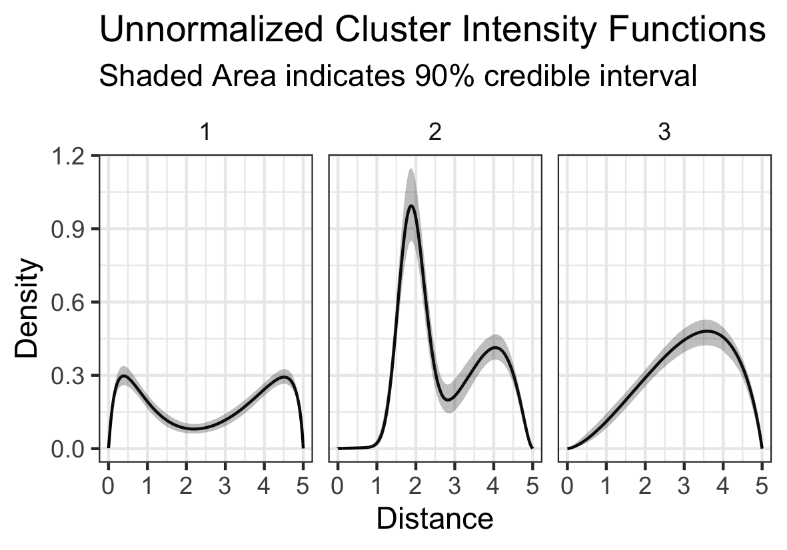
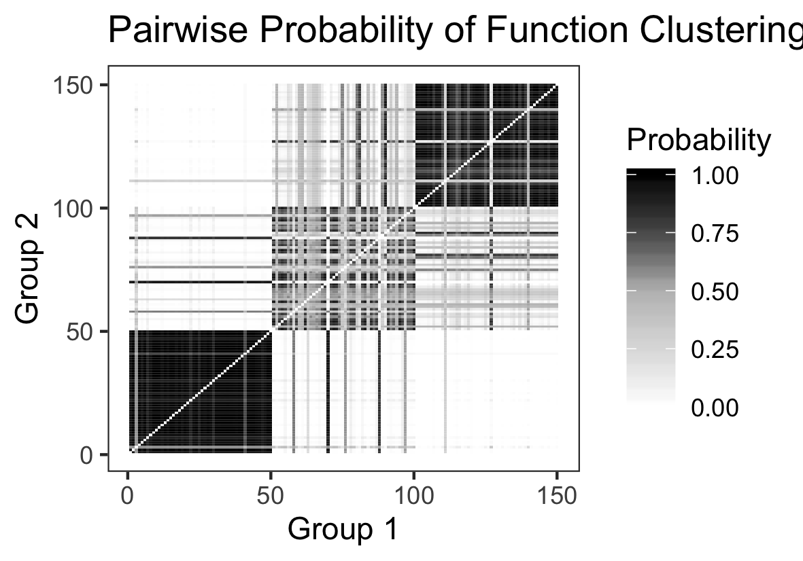

# Summary

The built environment consists of the human made space in which humans live, work and recreate everyday. 
While the features of the built environment range from sidewalk and green space availability to the presence of 
certain restaurants or community amenities, the focus of this package and paper is on the latter. Specifically, our
objective is to model the spatial variability of built environment features (BEF) of a specific class around locations
where humans spend most of their time and group these spatial patterns into some number of common clusters. To put
this into more concrete terms, we may be interested in how often fast food restaurants are found around schools and 
whether there are certain schools that are more likely to have fast food restaurants closer to them than others.

``rndpp`` is an R package that estimates and clusters spatial intensity functions in a Bayesian paradigm drawing random
mixing measures via the Nested Dirichlet Process (NDP)  to non-parametrically estimate and cluster the aforementioned 
spatial variability. The `rndpp` provides MCMC methods for model fitting so that usual inference summaries - posterior
intervals and point estimates can be calculated.

# Demonstration 

We'll now briefly walk through both the theoretical underpinnings of this model set up, as well as a quick
example with simulated data.

## Theory

Suppose we're interested in exploring the example involving fast food restaurants (FFRs) posed in the first section.
Denote $r_{ij}$ as the distance between the $i$th FFR and the $j$th school within radius $R$. There are
$n_j$ FFRs around the $j$th school and $J$ schools total. We can model these distances as realizations of some number 
of independent Inhomogeneous Poisson Processes each with spatial intensity $f_j(\cdot)$ and $\gamma_j$ mean number of
FFRs within R. From this modeling assumption we gain the following posterior probability expression:

$$
p(\{r_{ij}\} | f_j(\cdot),\gamma_j ) \propto \prod_{j=1}^{J} \gamma_j^{n_j} \exp \{ - \gamma_j \} \prod_{i=1}^{n_j}f_j(r_{ij})
$$

From the above we can see that $\gamma_j$ can be modeled separately from $f_j(\cdot)$. The `rndpp` provides a
simple function `nhpp_hmc` for estimating $\gamma_j$ as an exponential function of some covariates: 
$\log(\gamma_j) = x_j^{T}\beta$. This is similar to the `stats::glm` function with the `family = gamma(link='log')` setting.
Since this model is straightforward and more can be read about it in existing literature, the remainder of this document
will focus on the estimation of the $f_j(\cdot)$ through the NDP.

## Simulation

The first figure below illustrates the true intensity functions from which 50 schools are each simulated. 

*Figure 1*

After fitting the model, helper functions included in `rndpp` allow for easy visualization of the estimated clusters 
both via the estimated densities (Figure 2) and the pairwise probability of co-cluster assignment (Figure 3).
The latter is often used in the context of mixture models, since label switching is expected between iterations of
the MCMC  sampler.

*Figure 2*

The above plot shows our model correctly estimated the true intensity functions, though it may be noticed that the 
intensity functions always go to zero at the end of the distance. This is because of a "edge effect" that results
from using a mixture of normals to estimate the intensity functions. The `rndpp` also offers users the option to
use a mixture of beta densities, which will not have this some problem. However, it should be noted that 
sampling with the beta densities is less efficient than with the normal.

*Figure 3*

Continuing our examination of the results, we can see that in the above pairwise plot the model is clearly able 
to distinguish between the 3 different clusters, though it is more easily able to distinguish between cluster 1 
and 2 than cluster two and three.

# Acknowledgments

This work was developed with support from NIH grant R01-HL131610 (PI: Sanchez).
